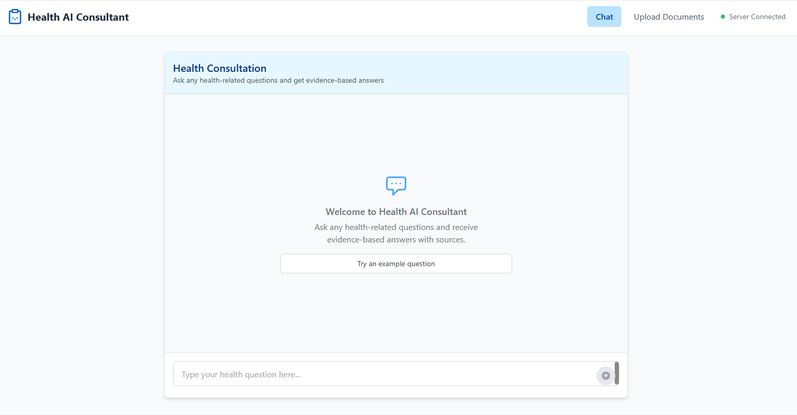

# Health AI Consultant

A professional RAG-powered health consultation application using Flask, React, and Ollama.



## Overview

Health AI Consultant is a modern web application that provides AI-powered health information and consultation services. It uses Retrieval-Augmented Generation (RAG) to ensure responses are grounded in reliable health information, preventing hallucinations and providing factual answers to health-related queries.

The application features a clean, professional user interface built with React and Tailwind CSS, and a robust backend powered by Flask and Ollama. All processing happens locally, ensuring privacy and data security.

## Features

- **AI-Powered Health Chat**: Ask health-related questions and receive informative responses
- **Document Upload**: Add health documents to enhance the knowledge base
- **Citation Support**: View sources for information provided in responses
- **Responsive Design**: Works on desktop and mobile devices
- **Local Processing**: All data stays on your machine for privacy

## Tech Stack

### Backend
- **Flask**: Python web framework for the API
- **Ollama**: Local large language model inference
- **ChromaDB**: Vector database for document storage and retrieval
- **LangChain**: Framework for building LLM applications

### Frontend
- **React**: JavaScript library for building the user interface
- **Vite**: Next-generation frontend tooling
- **Tailwind CSS**: Utility-first CSS framework
- **React Router**: Declarative routing for React

## Getting Started

### Prerequisites

- Python 3.9+
- Node.js 16+
- Ollama installed and running locally

### Installation

1. Clone the repository:
   ```
   git clone https://github.com/yourusername/health-ai-consultant.git
   cd health-ai-consultant
   ```

2. Set up the backend:
   ```
   # Install Python dependencies
   pip install -r requirements.txt
   ```

3. Set up the frontend:
   ```
   cd frontend
   npm install
   ```

4. Create a `.env` file in the root directory with the following content:
   ```
   OLLAMA_BASE_URL=http://localhost:11434
   FLASK_ENV=development
   DEBUG=True
   ```

### Running the Application

1. Start the backend server:
   ```
   python app_flask.py
   ```

2. In a separate terminal, start the frontend development server:
   ```
   cd frontend
   npm run dev
   ```

3. Open your browser and navigate to `http://localhost:3000`

## Usage

1. **Chat Interface**: Type your health-related questions in the chat input and press Enter or click the Send button
2. **Document Upload**: Navigate to the Upload section to add health documents to the knowledge base
3. **View Sources**: Click on citations in responses to see the source of information

## Deployment

The application can be deployed using:
- Frontend: Vercel, Netlify, or GitHub Pages
- Backend: Railway, Render, or any platform supporting Python applications

## License

This project is licensed under the MIT License - see the LICENSE file for details.

## Acknowledgments

- Built with Ollama for local AI inference
- Powered by LangChain and ChromaDB for RAG capabilities
- Designed with Tailwind CSS for a modern UI
